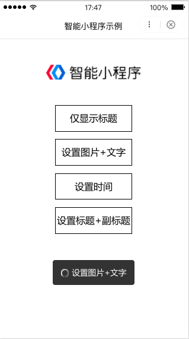

## BdToast百度小程序自定义通用组件
BdToast百度小程序自定义通用组件

## 需求
手百小程序的toast仅支持在页中展示，不能自定义位置、字体大小、在单个文本中增加icon等需求；因此自定义一个全局可通用的Toast。

## 效果预览




## 如何使用

代码目录位于 `/widget/toast` 下，包含3个文件

- toast.js 脚本代码
- toast.css 样式文件，可以根据自己需求定制
- toast.swan 模板结构，可以根据自己需求定制

### 使用步骤一：
将/widget/toast的三个文件，放在与page同名的widget文件夹中，如果项目没有widget文件夹，就新建一个。


### 使用步骤二：
在项目的整个 `app.js` 中引入，一次引入，所有page均可以使用：

```
// app.js
import { BdToast } from './widget/toast/toast.js';

App({
    BdToast, // 挂载
    onLaunch(options) {
        // do something when launch
    },
    onShow(options) {
        // do something when show
    },
    onHide() {
        // do something when hide
    }
});
```


### 使用步骤三：

在项目的app.css中引入 `toast.css`：

```
// app.css
@import "./widget/toast/toast.css";

```


### 使用步骤四：
在需要的page页面，将模板引入：

```
// pages/index/index.swan
<!-- toast使用 -->
<import src="/widget/toast/toast.swan"/>
<template is="bdtoast" data="{{bdtoast}}"/>


```

### 使用步骤五

在具体的页面进行初始化调用：

```
// 初始化
new app.BdToast();

// 具体调用：
Page({
    data: {},
    onLoad() {
        new app.BdToast();
    },
    clickShowToast(e) {
        switch (+e.target.dataset.id) {
            case 1:
                this.bdtoast.toast({
                    title: '仅显示标题'
                });
                break;
            case 2:
                this.bdtoast.toast({
                    title: '设置图片+文字',
                    iconSrc: '../../images/loading.gif'
                });
                break;
            case 3:
                this.bdtoast.toast({
                    title: '设置时间',
                    duration: 1000
                });
                break;
            case 4:
                this.bdtoast.toast({
                    title: '设置标题',
                    subTitle: '副标题'
                });
                break;
        }
    }
});

```


参数说明：


|参数| 类型| 必填 |说明|
|---| ---|---|---|---|
|title |string| 是 | 标题|
|iconSrc |string | 否 | icon地址，提供icon的url，icon大小为32px * 32px|
|subTitle |string | 否 | 副标题，同时需要title存在才会显示，否则不显示副标题|
|duration | number| 否| 持续时间，不填默认1500毫秒|
|success| function| 否 | 执行成功的回调|
|fail| function | 否| 执行失败的回调|
|complete| function| 否| 完成的回调，不管有没有执行成功|


## 最后说明
例子Demo中也有关于toast的点击tap事件的绑定，因为此功能不是很常用，有兴趣的可以clone下来自行研究。另外，如果有样式结构或者样式不符合需求的话，可以自己在 `widget/toast`的源码中进行更新，直到符合自己的需求~
欢迎star、issue和pull request~


